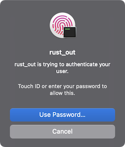

# `localauthentication-rs`



`localauthentication-rs` provides a wrapper for [LAContext](https://developer.apple.com/documentation/localauthentication/lacontext) in Apple's [LocalAuthentication framework](https://developer.apple.com/documentation/localauthentication).

> **Warning**
> This is **still in development**! There may be breaking changes in the future.

This crate can be used to verify a user's identity in macOS (or iOS), being able to choose how via the `LAPolicy` enumeration:

- `DeviceOwnerAuthenticationWithBiometrics`: User authentication with biometry.
- `DeviceOwnerAuthentication`: User authentication with Apple Watch, biometry, or the device passcode.
- `DeviceOwnerAuthenticationWithWatch`: User authentication with Apple Watch.
- `DeviceOwnerAuthenticationWithBiometricsOrWatch`: User authentication with either biometry or Apple Watch.

In the example below, we attempt to authenticate with the user via their biometrics (Touch ID or Face ID), Apple Watch, or in the "worst case scenario", their account password:

```rs
use localauthentication_rs::{LAPolicy, LocalAuthentication};

fn main() {
    // Create a new instance of LocalAuthentication
    let local_authentication = LocalAuthentication::new();

    // Try to authenticate the user
    let authenticated = local_authentication.evaluate_policy(
        LAPolicy::DeviceOwnerAuthenticationWithBiometrics,
        "authenticate your user",
    );

    // Print the result
    if authenticated {
        println!("Welcome!");
    } else {
        println!("Not authenticated...");
    }
}
```

## License

Licensed under either of

- Apache License, Version 2.0
  ([LICENSE-APACHE](LICENSE-APACHE) or http://www.apache.org/licenses/LICENSE-2.0)
- MIT license
  ([LICENSE-MIT](LICENSE-MIT) or http://opensource.org/licenses/MIT)

at your option.

## Contribution

Unless you explicitly state otherwise, any contribution intentionally submitted
for inclusion in the work by you, as defined in the Apache-2.0 license, shall be
dual licensed as above, without any additional terms or conditions.
